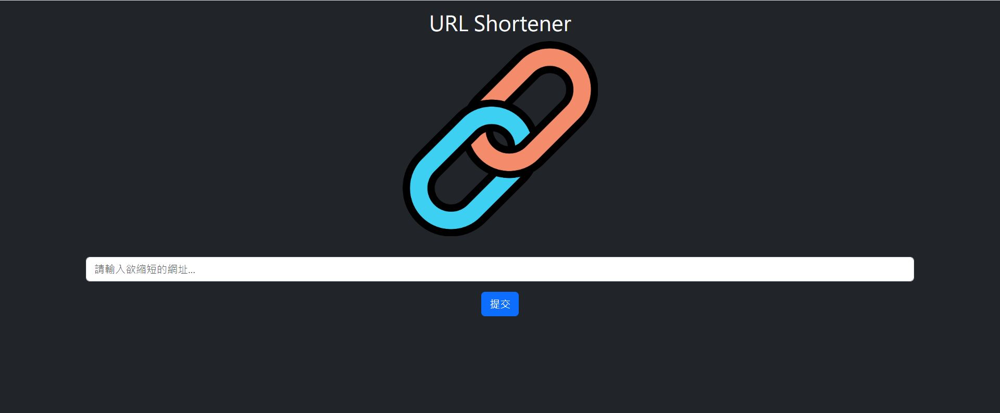

## URL Shortener



### 功能
+ 輸入網址以獲得短網址
+ 輸入短網址以導向原網址

### 開始使用
1. 請先確認有安裝Node.js及npm
2. Clone本專案至您的電腦：開啟終端機，進入欲存放本專案的資料夾路徑，輸入以下指令

```bash
git clone https://github.com/realyutou/URL-Shortener.git
```

3. 安裝相關套件：輸入以下指令

```bash
npm install
```

4. 安裝完畢後，設定.env環境變數連線 MongoDB

```bash
MONGODB_URI=mongodb+srv://<Your MongoDB Account>:<Your MongoDB Password>@cluster0.xxxx.xxxx.net/<Your MongoDB Table><?retryWrites=true&w=majority
```

5. 執行此專案：輸入以下指令

```bash
npm run start
```

6. 若終端機出現以下訊息，代表專案已順利執行，請至瀏覽器進入該網址

```bash
The server is running on http://localhost:3000
```

7. 若欲暫停使用

```bash
ctrl + c
```

### 開發工具
  + Node.js 18.16.0
  + Express 4.17.1
  + Express-handlebars 4.0.2
  + Bootstrap 5.3.0
  + Dotenv 16.3.1
  + Mongoose 5.9.7